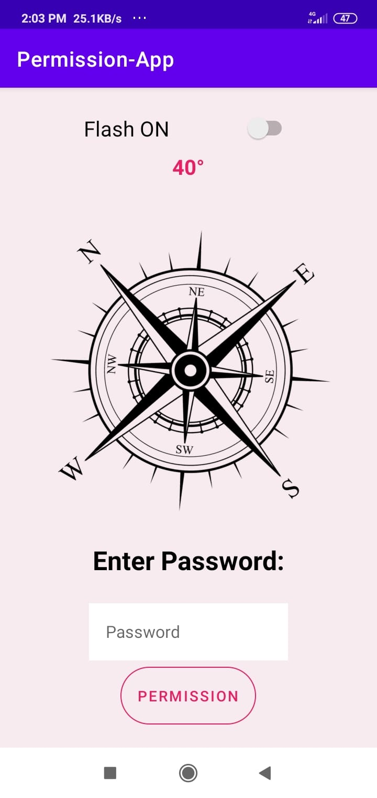
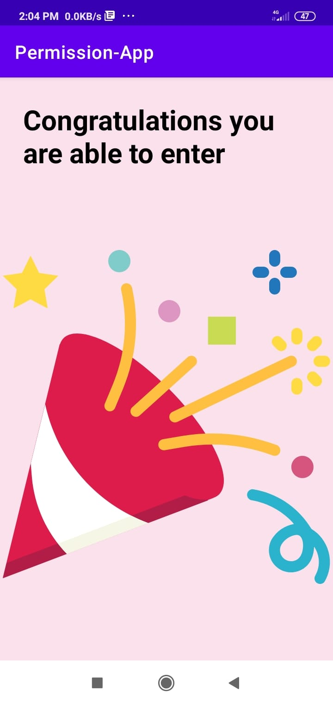

# Permission_App
This is a code for the permissions application when the user you can go to the next page only if the following conditions are happen:
The flash must be active,
The volume must be at maximum,
The compass must be moved 152 degrees
And the password must be about the percentage of the battery.

